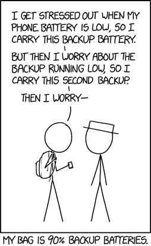
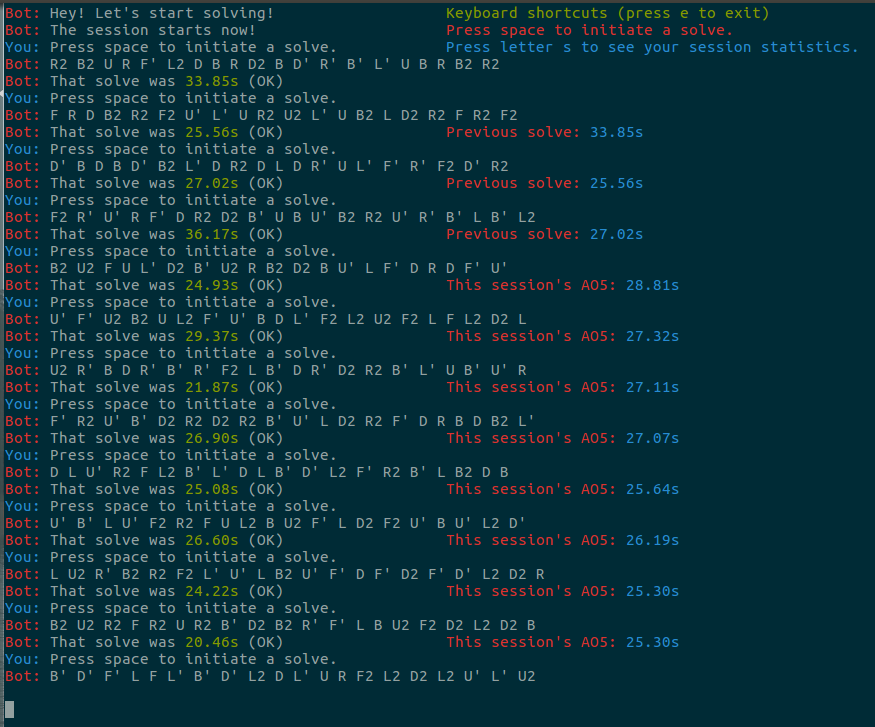
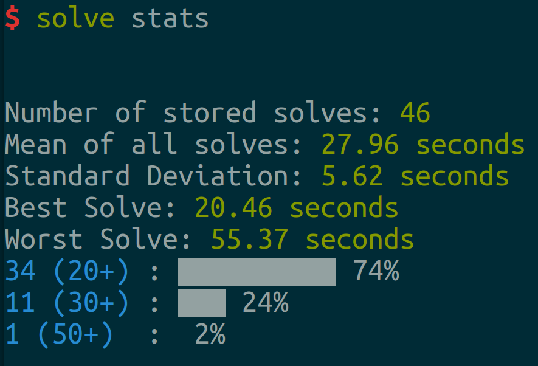
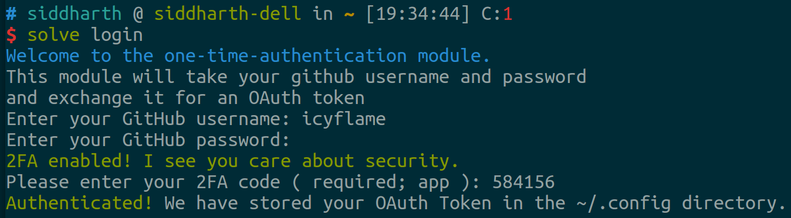
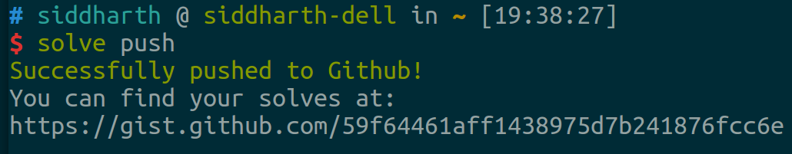
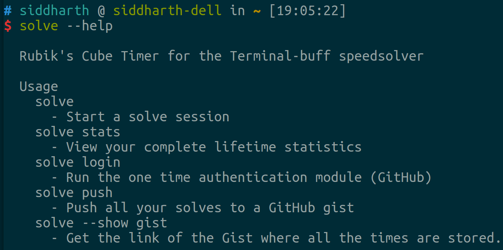

# cli-cube-timer

## Who?

A [lot of people](https://www.reddit.com/r/cubing/) solve the Rubik's Cube
competitively. The [World Cube
Association](https://www.worldcubeassociation.org/) organises periodic
competitions throughout the globe. Before going to these competitions, people
practice their Rubik's Cube solving skills at home.

For this, most people use a computer and timer software. Some common browser
based timers are [csTimer](http://cstimer.net/) and
[qqTimer](http://www.qqtimer.net/). There are also
[several](https://play.google.com/store/search?q=cubing%20timer&c=apps)
[apps](https://play.google.com/store/apps/details?id=com.avelsoft.cubetimer) on
the [Play
Store](https://play.google.com/store/apps/details?id=air.tw.url.omega.FingerTimer)
that emulate the functionality of the offical timers.

Especially with browser based timers, the times are stored in JavaScript's
LocalStorage. That is an extremely unstable form of storage because it gets
cleared whenever you delete the cached images, files and cookies (periodically
doing that speeds up your browser). I was frustrated with losing 100s of solve
times and the statistics related to that, because of mistakenly clearing or
installing an update.

## So?

This module is my way around that. The times are now stored safely on your hard
disk. You can't clear this file, unless you go hunting for it and then delete
it.

But, of course, there might be a catastrophic [hard disk
failure](https://en.wikipedia.org/wiki/Hard_disk_failure). You must have a
backup.

So, always back your times up on a [Gist](https://gist.github.com/). You need a
GitHub account to store your solves on a Gist.

## Some screenshots!

#### A solving session

#### Statistics

#### Logging into GitHub

#### Pushing your solves to a Gist

#### What does the Gist look like?

6. Help text

## Help text from the module

### solve

> Primary command line executable name.

This will begin a solving session. All session statistics will be stored locally for this session.

### solve stats

> View your lifetime statistics

This will show you the mean, the standard deviation and the distribution of your solve times.
This part section is always open for improvement. The code for this is implemented using
`fast-stats` and `fast-csv` node modules. So, this is one thing that you can always contribute to!

### solve push

> Push all your solves to a gist

Ever wanted to take a backup? Well, do this, and everything stays backed up!
Psst, You can always add more data to your gist, from any other place that you may
have recorded solves previously, and this app will automatically account for that when
calculating stats using `solve stats`. Handy, huh?

### solve login

> One time GitHub authentication

This will make some API calls to GitHub's OAuth Authorizations API, and exchange your username and
password for an OAuth token, that it will store locally, **on your machine**. So, you don't have to enter
the username and password everytime you want to push, and the OAuth token stays safe.
**Psst,** you can delete and create a new OAuth token using this command at any time, just in case you think
there was a breach! (Everything will work exactly like before!)

### solve --show gist

> Print the URL where all your times are stored

This will print the URL to your gist, using your username and the gist ID that we have stored on
your machine.

## Contributing

I would love to have your help on this! Do check out the issues dashboard of this repository,
and submit a PR on any one of those issues, and I will be happy to merge! If there are no issues
on the dashboard, please do feel free to create new ones!

Code licensed under MIT.

Copyright Siddharth Kannan 2015.
